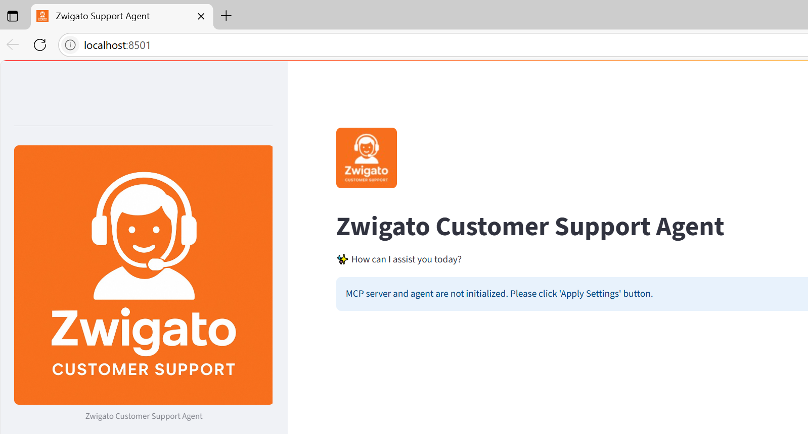
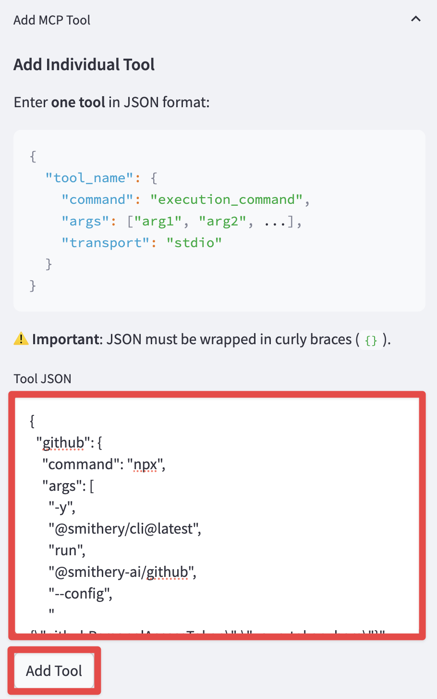
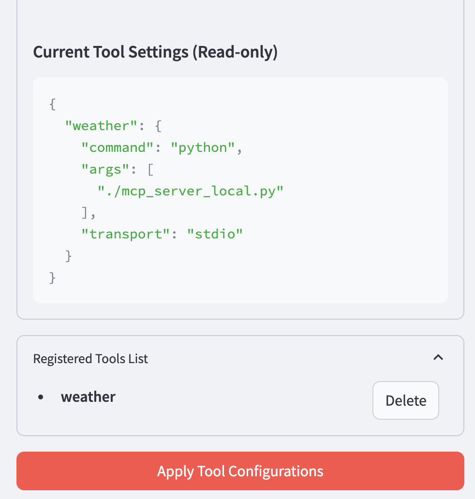
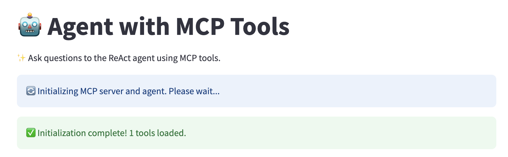
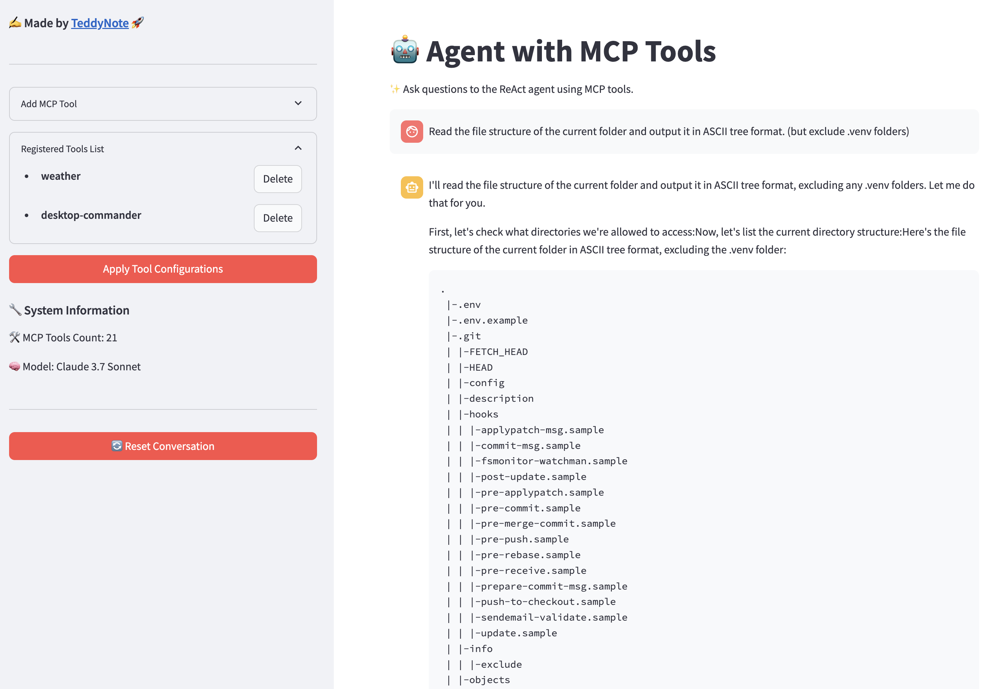

# LangGraph Agents + MCP: IK Inperson Demo


## Project Overview


`LangChain-MCP-Adapters` is a toolkit provided by **LangChain AI** that enables AI agents to interact with external tools and data sources through the Model Context Protocol (MCP). This project provides a user-friendly interface for deploying ReAct agents that can access various data sources and APIs through MCP tools.

### Features

- **Streamlit Interface**: A user-friendly web interface for interacting with LangGraph `ReAct Agent` with MCP tools
- **Tool Management**: Add, remove, and configure MCP tools through the UI (Smithery JSON format supported). This is done dynamically without restarting the application
- **Streaming Responses**: View agent responses and tool calls in real-time
- **Conversation History**: Track and manage conversations with the agent

## MCP Architecture

The Model Context Protocol (MCP) consists of three main components:

1. **MCP Host**: Programs seeking to access data through MCP, such as Claude Desktop, IDEs, or LangChain/LangGraph.

2. **MCP Client**: A protocol client that maintains a 1:1 connection with the server, acting as an intermediary between the host and server.

3. **MCP Server**: A lightweight program that exposes specific functionalities through a standardized model context protocol, serving as the primary data source.


## Software Installation Prior to using the Source Code

1. Verify Python version: MCP python librray library requires Python 3.10+ (with 3.12 recommended). The MCP Python REPL Server requires Python 3.11+. Please make sure to update the underlying Python version.

2. Install VS code community edition to navigate the codebase & edit.
https://code.visualstudio.com/docs/setup/setup-overview


## Using Source Code

1. Clone this repository

```bash
git clone 
cd langgraph-mcp-agents
```

2. Create a virtual environment and install dependencies.

```bash
# create virtual enviornment replace the content $$
python -m venv $virtual_env_name$
# Unix/ MAC
source $virtual_env_name$/bin/activate
# Windows
$virtual_env_name$\Scripts\activate
#Install the libraries
pip install -r requirements.txt
# If require to deactivate the virtual enviornment
deactivate
```

3. Create a `.env` file with your API keys (copy from `.env.example`)

```bash
cp .env.example .env
```

Enter your obtained API keys in the `.env` file.

(Note) Not all API keys are required. Only enter the ones you need.
- `ANTHROPIC_API_KEY`: If you enter an Anthropic API key, you can use "claude-3-7-sonnet-latest", "claude-3-5-sonnet-latest", "claude-3-haiku-latest" models.
- `OPENAI_API_KEY`: If you enter an OpenAI API key, you can use "gpt-4o", "gpt-4o-mini" models.
- `LANGSMITH_API_KEY`: If you enter a LangSmith API key, you can use LangSmith tracing.
```bash
ANTHROPIC_API_KEY=your_anthropic_api_key
OPENAI_API_KEY=your_openai_api_key
LANGSMITH_API_KEY=your_langsmith_api_key
LANGSMITH_TRACING=true
LANGSMITH_ENDPOINT=https://api.smith.langchain.com
LANGSMITH_PROJECT=LangGraph-MCP-Agents
```

4. (New) Use the login/logout feature

When using the login feature, set `USE_LOGIN` to `true` and enter `USER_ID` and `USER_PASSWORD`.

```bash
USE_LOGIN=true
USER_ID=admin
USER_PASSWORD=admin123
```

If you don't want to use the login feature, set `USE_LOGIN` to `false`.

```bash
USE_LOGIN=false
```

## Build Up the Codebase


1. Let's identify the "To Do:" tasks to enrich the template to set up the MCP server and tst out the Agentic AI application.

2. Import the underying data source. (mcp_server_remote.py; Line 5)


3. Add the MCP server instruction to be used accross various agent development, feel free to use the smaple instruction to being with provided below. (mcp_server_remote.py; Line 20)

#### MCP server instruction starters:

"You are a Zwigato customer support assistant for food delivery. "
"Use the available tools to help customers with their Zwigato orders and queries. "
"If a customer asks about Zwigato services, policies (like cancellation, refunds), or membership (like Zwigato Gold), use the 'search_wiki' tool. "
"If a customer asks about their order status, use the 'read_order_status' tool with their order ID (e.g., ORDZW001). "
"If a customer wants to cancel an order, use the 'update_order_status' tool. For cancellations, set the new_status to 'cancelled'. "
"Be polite and helpful."


4. Import the various agents/ MCP tools. (app.py; Line 45 & Line 52)


## Usage

1. Start the Streamlit application.

```bash
streamlit run app.py
```

2. The application will run in the browser and display the main interface.



3.  One way to configure MCP tools is to use the sidebar. However we will build MCP tools ourselves following the steps mentioned in the section above.


Visit [Smithery](https://smithery.ai/) to find useful MCP servers.

First, select the tool you want to use.

Click the COPY button in the JSON configuration on the right.


Paste the copied JSON string in the `Tool JSON` section.



Click the `Add Tool` button to add it to the "Registered Tools List" section.

Finally, click the "Apply" button to apply the changes to initialize the agent with the new tools.



4. Check the agent's status.



5. Interact with the ReAct agent that utilizes the configured MCP tools by asking questions in the chat interface.




## References

- https://github.com/langchain-ai/langchain-mcp-adapters